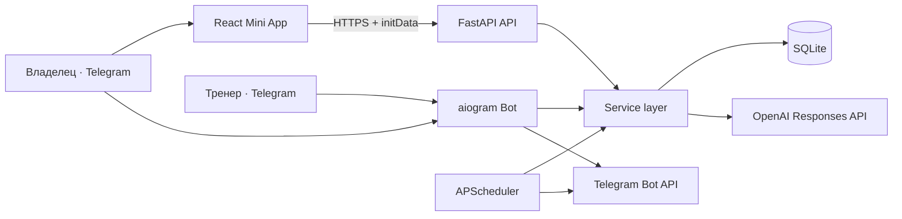

# Архитектура FIT AI

## Контекст

FIT AI состоит из трёх независимо запускаемых приложений и общего хранилища. Mini App — единственный основной пользовательский интерфейс; бот служит входной точкой Telegram, каналом уведомлений и интерфейсом тренера.

## Каталоги

| Каталог | Ответственность |
|---|---|
| `frontend/` | React + TypeScript Mini App, mock/API adapters, мобильный UI |
| `backend/app/api.py` | HTTP endpoints и dependency-based access control |
| `backend/app/services.py` | бизнес-правила, расчёты, отчёты, AI-контекст |
| `backend/app/models.py` | SQLAlchemy-модели |
| `backend/alembic/` | версионирование схемы |
| `bot/main.py` | команды владельца, trainer callbacks и FSM комментария |
| `bot/scheduler.py` | событийные напоминания и недельный отчёт |
| `assets/exercises/` | единый источник изображений упражнений |
| `data/` | локальная SQLite БД; не коммитится |
| `tests/` | async unit/integration tests |
| `deploy/` | systemd и nginx примеры |

## Поток запроса Mini App

1. Telegram открывает опубликованный frontend и передаёт подписанный `initData`.
2. Frontend добавляет его в `X-Telegram-Init-Data`.
3. Backend проверяет HMAC, время подписи и Telegram ID.
4. Dependency `require_owner` или `require_trainer` ограничивает endpoint.
5. Service layer выполняет бизнес-логику и одну транзакцию SQLAlchemy.

Frontend не доверяет параметрам URL и не определяет роль самостоятельно.

## Тренировочный цикл

`users.current_cycle_position` указывает на следующую позицию 0…3. Пропущенные календарные дни не меняют позицию. При первом успешном завершении session позиция увеличивается по модулю 4; повторный запрос завершения безопасен и не двигает цикл второй раз.

Подход идентифицируется ключом `(session, exercise, set_number)`. Повторный `PUT` обновляет тот же подход и защищает от двойного тапа или сетевого retry.

## Автоматизация

APScheduler запускается в процессе бота. Напоминания вычисляются относительно последней записи:

- утренний вес — если сегодня записи ещё нет;
- питание — если дневной nutrition log отсутствует;
- тренировка — после 2–3 дней отдыха от последней completed session;
- фото — через 14 дней от последнего фото;
- недельный отчёт — по rolling-периоду, без жёсткой привязки тренировок к неделе.

## AI Coach

Backend формирует allowlist-контекст за последние 7 дней: числовые показатели веса, питания, тренировок/подходов, кардио, подтягиваний и самочувствия. Telegram ID, имя, заметки и progress photos не входят в prompt. Результат сохраняется в `ai_reports` и доступен только владельцу.

## Ограничения текущего масштаба

- SQLite подходит для одного пользователя, одного тренера и одного VPS.
- Backend следует запускать одним worker: bot и API совместно используют SQLite.
- Отправка отчёта после HTTP-запроса выполняется FastAPI background task. Для гарантированной доставки при большом масштабе нужен persistent job queue.
- Файлы progress photos зарезервированы моделью, но публичный upload endpoint намеренно не реализован.

## Эволюция

При росте: PostgreSQL → Redis/queue → object storage для фото → отдельный worker автоматизаций → observability. Контракты API и service layer позволяют менять инфраструктуру без переписывания Mini App.
