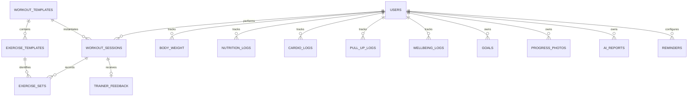

# База данных FIT AI

## Технология

SQLAlchemy 2 async + `aiosqlite`, миграции Alembic. По умолчанию файл находится в `data/fit_ai.db`.



## Таблицы

| Таблица | Содержимое | Важные ограничения |
|---|---|---|
| `users` | Telegram ID, роль, позиция и номер цикла | unique `telegram_id` |
| `workout_templates` | четыре тренировки | unique `name`, `cycle_position` |
| `exercise_templates` | упражнения, вес, диапазон, image key | unique `(template, sort_order)` |
| `workout_sessions` | состояние фактической тренировки, RPE, объём | status indexed |
| `exercise_sets` | вес/повторы одного подхода | unique `(session, exercise, set_number)` |
| `body_weight` | измерения веса | timestamp indexed через user |
| `nutrition_logs` | дневные калории и БЖУ | unique `(user, log_date)` |
| `cardio_logs` | дистанция, время, рассчитанные темп/скорость/PR | исходные и derived metrics |
| `pull_up_logs` | повторы и дополнительный вес | история результатов |
| `wellbeing_logs` | оценка, сон, энергия, soreness | числовой AI-вход |
| `goals` | вес, подтягивания, жим, 5 км | active flag |
| `progress_photos` | только приватный storage path и metadata | не входит в AI/trainer report |
| `ai_reports` | текст анализа, модель, prompt version | audit history |
| `trainer_feedback` | 👍 или комментарий | один feedback на session |
| `reminders` | тип, локальное время, timezone, last sent | дедупликация отправок |

Денежный float не используется: веса и макросы хранятся как `Numeric`. Кардио-скорость и темп — производные `Float`, исходные distance/duration остаются точными.

## Миграции

Применить:

```bash
alembic upgrade head
```

Проверить текущую версию:

```bash
alembic current
alembic history
```

Создать после изменения models:

```bash
alembic revision --autogenerate -m "describe change"
```

Всегда просматривайте generated migration перед применением и не редактируйте production DB через `Base.metadata.create_all`.

## Seed

```bash
python -m backend.app.seed
python -m backend.app.seed --demo
```

Оба режима идемпотентны. Demo-строки имеют marker в `notes` там, где это предусмотрено, и не перезаписывают пользовательскую nutrition-запись того же дня.

## Backup и восстановление

Для консистентной копии остановите оба процесса или используйте SQLite backup command:

```bash
sudo systemctl stop fit-ai-bot fit-ai-backend
cp data/fit_ai.db "data/fit_ai-$(date +%F-%H%M).db"
sudo systemctl start fit-ai-backend fit-ai-bot
```

Файлы `fit_ai.db-wal` и `fit_ai.db-shm`, если появились, относятся к той же БД. Не копируйте только основной файл во время записи.

Проверка восстановления: скопировать backup в отдельный каталог, указать отдельный `DATABASE_URL`, выполнить `alembic current` и smoke tests.

## Переход на PostgreSQL

Нужны `asyncpg`, новый `DATABASE_URL`, review типов/индексов и миграция данных. Service/API contracts сохраняются. Переход обязателен до горизонтального масштабирования или нескольких API workers.
