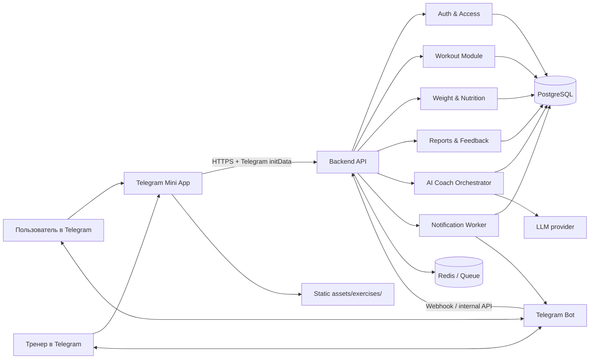
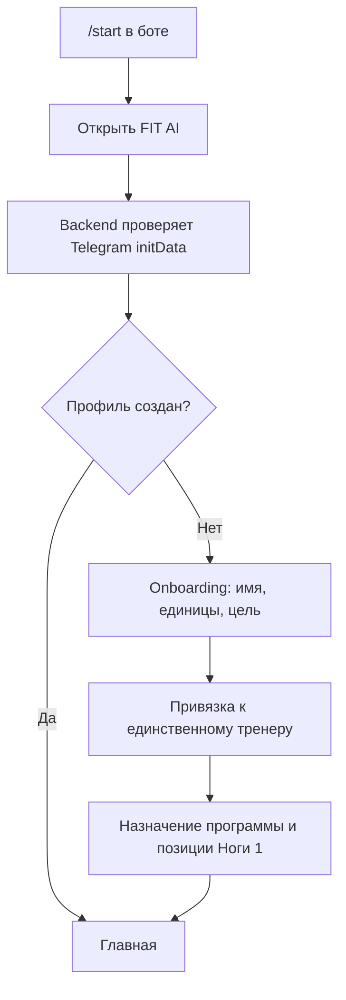
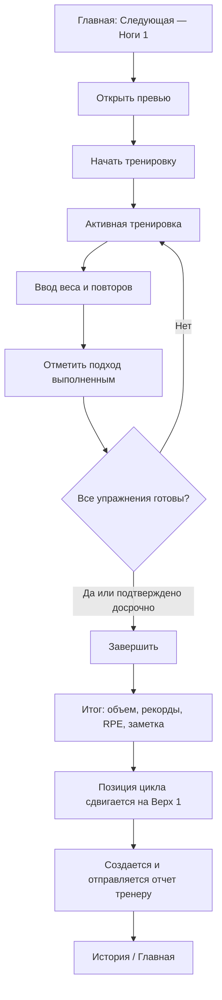
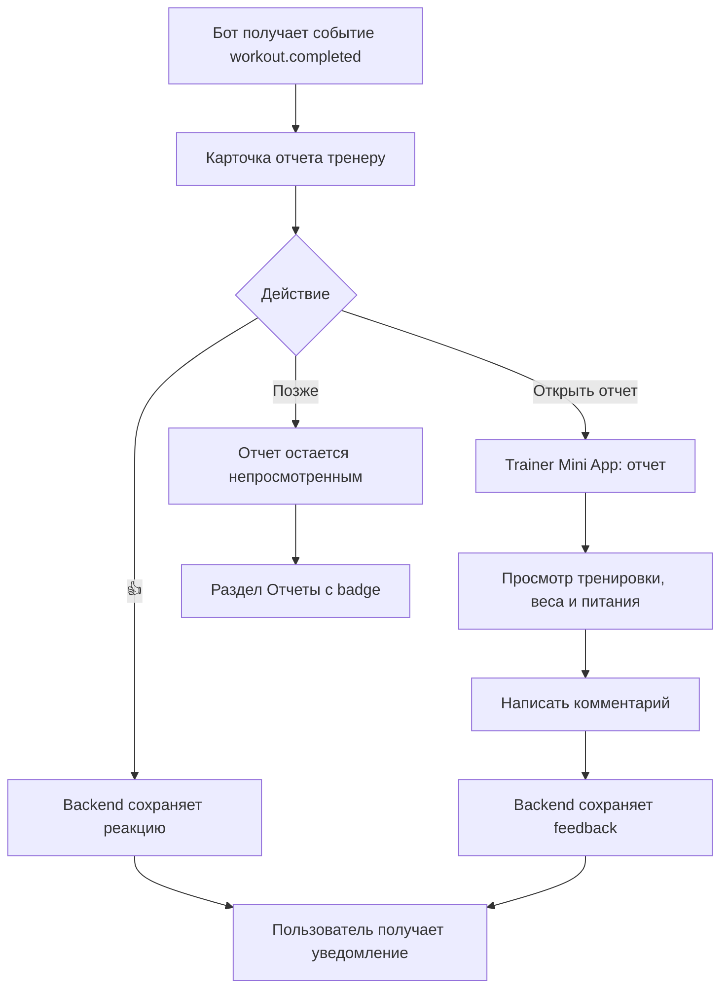

# FIT AI — продуктовая спецификация

Версия: 1.0  
Статус: концепция до начала разработки  
Платформа: Telegram Mini App + Telegram Bot

## 0. Краткое определение продукта

FIT AI — личный фитнес-дневник внутри Telegram. Пользователь ведет силовые тренировки, вес и питание в полноценном визуальном Mini App. Telegram Bot не заменяет интерфейс приложения: он открывает Mini App, присылает системные уведомления и доставляет тренеру отчет после тренировки.

Основная продуктовая метафора — Hevy / Strong / Strava внутри Telegram: быстрый ввод во время тренировки, заметный прогресс, аккуратная темная тема, карточки, графики и минимум чатовых сценариев.

### Цели MVP

1. Позволить начать тренировку не более чем за два действия после открытия приложения.
2. Надежно вести подходы, повторы, рабочий вес и заметки с автосохранением.
3. Автоматически двигать пользователя по циклу `Ноги 1 → Верх 1 → Ноги 2 → Верх 2` без привязки к календарю.
4. Показывать динамику силы, массы тела и питания.
5. Автоматически отправлять одному тренеру структурированный отчет и получать от него реакцию или комментарий.
6. Давать пользователю персональные AI-рекомендации на основании его данных.

### Не входит в MVP

- социальная лента, рейтинги и публичные профили;
- маркетплейс тренеров и несколько тренеров у одного пользователя;
- видеозвонки и полноценный мессенджер;
- привязка цикла к дням недели и понятие «просроченной тренировки»;
- автоматическое распознавание еды по фото;
- медицинская диагностика и лечебные рекомендации;
- конструктор произвольных тренировочных программ для пользователя.

## 1. Продуктовые правила

### 1.1. Цикл тренировок

Цикл хранится как упорядоченная последовательность из четырех шаблонов:

1. Ноги 1
2. Верх 1
3. Ноги 2
4. Верх 2

Правила перехода:

- у пользователя всегда есть один `current_cycle_position` от 0 до 3;
- календарная дата не влияет на позицию;
- если пользователь не тренировался несколько дней, текущая тренировка остается прежней;
- позиция сдвигается только после успешного действия «Завершить тренировку»;
- закрытие приложения, отмена или удаление незавершенной сессии не сдвигают цикл;
- после `Верх 2` следующей становится `Ноги 1`, а номер цикла увеличивается;
- сессия запоминает версию шаблона на момент старта, поэтому последующее изменение программы не меняет историю;
- в MVP нельзя вручную перескочить на другой слот. Тренер или администратор может скорректировать позицию через служебное действие с обязательным аудитом.

Состояния сессии:

```text
not_started → in_progress → completed
                    └──────→ cancelled
```

### 1.2. Отчет тренеру

После завершения тренировки backend создает неизменяемый снимок отчета. В него входят:

- имя пользователя, дата, название тренировки и длительность;
- упражнения, выполненные подходы, вес и повторы;
- личные рекорды и отклонения от предыдущей аналогичной тренировки;
- текущий вес и изменение относительно предыдущей записи;
- питание за день: калории, белки, жиры, углеводы и заметка;
- субъективная сложность/RPE и комментарий пользователя, если заполнены.

Бот отправляет тренеру компактную карточку с кнопками `👍` и `Открыть отчет`. Комментарий вводится на экране отчета Mini App. Допустимый облегченный сценарий — кнопка `💬 Комментарий` открывает сразу поле комментария в Mini App. Это сохраняет бот как транспорт, а не как основной чатовый продукт.

### 1.3. AI Coach

AI Coach доступен только роли `user`. Он использует только данные текущего пользователя: историю тренировок, подходов, веса, питания и субъективных оценок. Основной формат — карточки инсайтов, рекомендации к следующей тренировке и поле «Задать вопрос», а не бесконечный чат как главный интерфейс продукта.

AI Coach:

- объясняет прогресс и плато;
- предлагает рабочий диапазон веса/повторов, отдых и восстановление;
- анализирует соблюдение калорий и белка;
- не меняет программу и не записывает данные без явного подтверждения пользователя;
- не раскрывает данные тренеру и не доступен тренеру;
- показывает дисклеймер при вопросах о травмах, боли, заболеваниях или питании медицинского характера.

## 2. Общая архитектура

Для MVP рекомендуется модульный монолит: он быстрее в разработке и эксплуатации, но сохраняет четкие доменные границы для будущего разделения.



### 2.1. Клиенты

**Telegram Mini App**

- единое адаптивное web-приложение с ролевыми разделами пользователя и тренера;
- Telegram theme variables, safe areas, haptic feedback, BackButton и MainButton;
- mobile-first, портретный режим как основной;
- локальный черновик активной тренировки плюс серверное автосохранение;
- прямого доступа к базе данных нет.

**Telegram Bot**

- `/start` и кнопка открытия Mini App;
- проверка связи Telegram-аккаунта;
- уведомления пользователю: обратная связь тренера, необязательные напоминания, готовый недельный итог;
- отчет тренеру и inline-кнопка `👍`;
- deep links в конкретный экран Mini App;
- webhook принимает только Telegram updates и передает доменные действия backend.

### 2.2. Backend-модули

- `Auth`: проверка подписи Telegram `initData`, сессии, роли.
- `Users`: профиль, настройки, связь пользователь—тренер.
- `Programs`: программы, шаблоны, версии, позиция цикла.
- `Workouts`: сессии, упражнения, подходы, рекорды, автосохранение.
- `Tracking`: вес и дневное питание.
- `Reports`: снимки отчетов, доставка, реакции, комментарии.
- `AI Coach`: подготовка обезличенного контекста, guardrails, лимиты, журнал запросов.
- `Notifications`: очередь сообщений, повторная отправка, Telegram callback.
- `Analytics/Audit`: продуктовые события и чувствительные административные изменения.

### 2.3. Инфраструктура

- PostgreSQL — основной источник истины;
- Redis + очередь задач — дедупликация, rate limit, отправка отчетов и фоновые AI-задачи;
- статический CDN или сборка Mini App — картинки упражнений;
- система мониторинга ошибок и структурированные логи;
- отдельные окружения development, staging, production;
- ежедневные резервные копии БД и проверка восстановления.

## 3. User Flow пользователя

### 3.1. Первый запуск



Согласие с политикой данных и AI-дисклеймером фиксируется версией документа и временем.

### 3.2. Основной тренировочный flow



Важные ветки:

- при закрытии Mini App активная сессия восстанавливается;
- пустой подход не считается выполненным;
- завершение с невыполненными упражнениями требует подтверждения;
- повторный запрос завершения идемпотентен и не двигает цикл дважды;
- пользователь может исправить короткую заметку после завершения, но снимок отчета пересобирается и маркируется как обновленный; выполненные подходы после отправки в MVP не редактируются без служебной коррекции.

### 3.3. Вес, питание и AI

- `Главная → Вес → Добавить`: ввод значения, опциональная заметка, сохранение.
- `Главная → Питание`: калории и Б/Ж/У за выбранную дату, прогресс к цели.
- `AI Coach`: пользователь видит свежие инсайты, открывает объяснение или задает вопрос; ответ может ссылаться на конкретные тренировки, но не изменяет записи.
- `Уведомление от бота → Открыть комментарий`: deep link на завершенную тренировку и блок обратной связи тренера.

## 4. User Flow тренера



Дополнительный flow:

1. Тренер открывает Mini App из меню бота.
2. Видит список пользователей и очередь новых отчетов.
3. Фильтрует `Новые / Все`.
4. Открывает отчет, ставит одну реакцию `👍` и/или один актуальный комментарий.
5. Может отредактировать комментарий; пользователь видит пометку «изменено».

Тренер не видит AI Coach, AI-запросы пользователя, технические настройки программы и данные других тренеров.

## 5. Информационная архитектура и список экранов

### 5.1. Навигация пользователя

Нижняя навигация, пять пунктов:

1. `Главная`
2. `Тренировка`
3. `Прогресс`
4. `AI Coach`
5. `Профиль`

История доступна из `Главной` и `Прогресса`, питание и вес — через быстрые карточки на `Главной` и раздел `Прогресс`.

### 5.2. Экраны пользователя

| № | Экран | Назначение и основные элементы |
|---|---|---|
| U1 | Загрузка / Auth | Логотип, skeleton; проверка `initData`, создание короткой серверной сессии. При запуске вне Telegram — объяснение и кнопка перехода в бот. |
| U2 | Onboarding | 3–4 коротких шага: имя, цель, единицы кг/фунты, часовой пояс, согласия. Прогресс шага и одна основная CTA. |
| U3 | Главная | Приветствие; hero-карточка следующей тренировки; активная сессия, если есть; вес сегодня; питание сегодня; последний feedback тренера; короткий AI-инсайт. |
| U4 | Превью следующей тренировки | Название слота, номер цикла, список упражнений с картинками, целевые подходы/повторы, прошлые результаты, ожидаемая длительность; CTA «Начать». |
| U5 | Активная тренировка | Таймер, общий прогресс, карточки упражнений, таблица подходов, прошлый результат, быстрый ввод, галочка выполнения, rest timer, заметка; sticky CTA завершения. |
| U6 | Выбор / добавление упражнения | Поиск и категории, единый каталог и изображения. В MVP добавление упражнения в текущую сессию можно разрешить как дополнительное, не меняющее шаблон. |
| U7 | Деталь упражнения | Изображение из `assets/exercises/`, название, целевые мышцы, техника, подсказки, история результатов и лучший подход. |
| U8 | Завершение тренировки | Проверка незаполненных упражнений, RPE/самочувствие, комментарий пользователя, итоговая CTA. |
| U9 | Итог тренировки | Длительность, объем, выполненные подходы, PR, сравнение с прошлой аналогичной тренировкой, следующий слот цикла, статус отправки тренеру. |
| U10 | История | Хронологическая лента карточек, фильтр по типу тренировки, календарь активности без понятия «пропуск». |
| U11 | Деталь прошлой тренировки | Полный состав, подходы, сравнение, пользовательская заметка, вес/питание дня, feedback тренера. |
| U12 | Прогресс | Период 4/8/12 недель; сводка регулярности, тренировочный объем, PR, вес и питание; переходы в детальные графики. |
| U13 | Прогресс упражнения | График estimated 1RM или лучшего веса, объем по тренировкам, таблица лучших результатов. |
| U14 | Вес | График, текущий и средний вес, изменение за период, список записей; добавить/изменить запись. |
| U15 | Питание | Выбор даты, калории, Б/Ж/У, цели и прогресс-бары, заметка; сохранение дневного итога. |
| U16 | AI Coach | Карточки «Сегодня», «Следующая тренировка», «Восстановление»; история рекомендаций; поле вопроса; ссылки на данные-основания. |
| U17 | Уведомления | Feedback тренера, системные события и готовые AI-инсайты; read/unread. Опционально для MVP, если все события отражаются на Главной. |
| U18 | Профиль и настройки | Профиль, единицы, цели питания, уведомления, политика данных, экспорт/удаление аккаунта, версия приложения. |
| U19 | Ошибка / offline / empty states | Повторить запрос, открыть сохраненную активную тренировку, понятные пустые состояния без технических кодов. |

### 5.3. Навигация и экраны тренера

Нижняя навигация: `Отчеты`, `Пользователи`, `Профиль`.

| № | Экран | Назначение и основные элементы |
|---|---|---|
| T1 | Очередь отчетов | Tabs `Новые / Все`, badge непросмотренных, карточки с пользователем, тренировкой, временем, ключевым результатом и наличием отклонений. |
| T2 | Деталь отчета | Тренировка, подходы, сравнение, PR, вес, питание, RPE, заметка; `👍`, поле комментария, отправка. |
| T3 | Пользователи | Список прикрепленных пользователей, поиск, дата последней тренировки, последний вес, статус нового отчета. |
| T4 | Карточка пользователя | Ограниченный обзор: последние тренировки, динамика веса, питание и история feedback. AI-данных и личных настроек нет. |
| T5 | Профиль тренера | Имя, Telegram, настройки уведомлений и выход. |

## 6. Визуальная система и UI-компоненты

### 6.1. Арт-дирекшн

- dark-first интерфейс, фон почти черный, поверхности на 1–2 уровня светлее;
- один энергичный акцентный цвет, например electric lime или cyan; красный только для ошибок/опасных действий;
- крупная спортивная типографика для цифр и итогов, спокойная системная типографика для текста;
- радиусы карточек 16–20 px, компактные тени или светлая обводка вместо «стеклянного» шума;
- табличный ввод подходов должен быть плотнее, чем обычные контентные карточки;
- анимации 150–250 мс, haptic feedback на выполненный подход, PR и сохранение;
- контраст WCAG AA, touch target минимум 44×44 px, поддержка системного увеличения текста.

Рекомендуемые токены:

- spacing: 4, 8, 12, 16, 24, 32;
- radius: 10 для полей, 16 для карточек, 24 для hero;
- типографика: 12 caption, 14 secondary, 16 body, 20 title, 28–36 metric;
- состояния: default, pressed, focused, disabled, loading, error, success.

### 6.2. Базовые компоненты

**Навигация и структура**

- App Shell с Telegram safe areas;
- Bottom Navigation с badge;
- Top Bar, Back Button, context menu;
- Sticky Action Bar;
- Bottom Sheet и modal confirmation;
- Tabs / segmented control.

**Карточки**

- Next Workout Hero Card;
- Active Workout Card;
- Exercise Card;
- Workout History Card;
- Metric Card;
- Nutrition Summary Card;
- Trainer Feedback Card;
- AI Insight Card;
- Report Card для тренера.

**Ввод данных**

- Set Row: номер, предыдущий результат, кг, повторы, RPE, check;
- Numeric Input с крупной клавиатурой и stepper;
- Macro Input;
- Weight Quick Add;
- Textarea с лимитом;
- Date selector;
- Search field и filter chips;
- Rating/RPE selector 1–10.

**Отображение данных**

- Progress Ring;
- Line/Bar Chart с tooltip;
- PR Badge;
- Status Chip;
- Delta Indicator;
- Skeleton;
- Empty State;
- Toast / inline error;
- Rest Timer.

### 6.3. Изображения упражнений

- единственный источник локальных иллюстраций: `assets/exercises/`;
- единый формат имен: `{exercise_slug}.webp`, например `barbell-squat.webp`;
- одинаковые холст, ракурс, фон, палитра и масштаб фигуры;
- рекомендуемое соотношение 4:3 или 1:1, не менее 800 px по длинной стороне;
- в БД хранится `image_key`, а не произвольный внешний URL;
- UI строит путь `/assets/exercises/{image_key}.webp`;
- обязательный placeholder, если файл отсутствует;
- SVG-иконки интерфейса не смешиваются с иллюстрациями упражнений.

## 7. Схема базы данных

PostgreSQL, UUID как публичные идентификаторы, `timestamptz` для времени, даты питания/веса интерпретируются в часовом поясе пользователя. Во всех изменяемых сущностях — `created_at`, `updated_at`; для чувствительных удалений предпочтителен `deleted_at`.

### 7.1. Пользователи и доступ

**users**

- `id uuid PK`
- `telegram_user_id bigint UNIQUE NOT NULL`
- `role enum(user, trainer, admin)`
- `display_name varchar(100)`
- `username varchar(64) nullable`
- `timezone varchar(64)`
- `unit_system enum(metric, imperial)`
- `status enum(active, blocked, deleted)`
- `onboarding_completed_at timestamptz nullable`

**user_profiles**

- `user_id uuid PK/FK users`
- `goal enum(gain, maintain, lose, performance)`
- `daily_calorie_target int nullable`
- `protein_target_g numeric nullable`
- `fat_target_g numeric nullable`
- `carbs_target_g numeric nullable`
- `notification_settings jsonb`

**trainer_assignments**

- `id uuid PK`
- `trainer_id uuid FK users`
- `user_id uuid FK users UNIQUE`
- `status enum(active, inactive)`
- `assigned_at timestamptz`

Ограничение MVP на уровне бизнес-логики: активна только одна учетная запись тренера; у пользователя не более одного активного назначения.

### 7.2. Каталог и программа

**exercises**

- `id uuid PK`
- `slug varchar UNIQUE`
- `name varchar`
- `category enum(legs, chest, back, shoulders, arms, core, cardio, other)`
- `primary_muscles text[]`
- `equipment varchar nullable`
- `instructions text nullable`
- `image_key varchar NOT NULL`
- `is_active boolean`

**programs**

- `id uuid PK`
- `name varchar`
- `version int`
- `status enum(draft, active, archived)`
- `created_by uuid FK users`

**workout_templates**

- `id uuid PK`
- `program_id uuid FK programs`
- `cycle_position smallint CHECK 0..3`
- `name varchar` — Ноги 1 / Верх 1 / Ноги 2 / Верх 2
- `estimated_duration_min int nullable`
- UNIQUE(`program_id`, `cycle_position`)

**workout_template_exercises**

- `id uuid PK`
- `template_id uuid FK workout_templates`
- `exercise_id uuid FK exercises`
- `sort_order int`
- `target_sets smallint`
- `target_rep_min smallint nullable`
- `target_rep_max smallint nullable`
- `target_rpe numeric nullable`
- `rest_seconds int nullable`
- `coach_note text nullable`

**user_program_assignments**

- `id uuid PK`
- `user_id uuid FK users`
- `program_id uuid FK programs`
- `current_cycle_position smallint DEFAULT 0`
- `cycle_number int DEFAULT 1`
- `status enum(active, completed, cancelled)`
- `assigned_at timestamptz`
- `completed_at timestamptz nullable`

Только одно активное назначение на пользователя. Сдвиг позиции выполняется в одной транзакции с завершением сессии.

### 7.3. Тренировки

**workout_sessions**

- `id uuid PK`
- `user_id uuid FK users`
- `assignment_id uuid FK user_program_assignments`
- `template_id uuid FK workout_templates`
- `template_snapshot jsonb NOT NULL`
- `cycle_position smallint`
- `cycle_number int`
- `status enum(in_progress, completed, cancelled)`
- `started_at timestamptz`
- `completed_at timestamptz nullable`
- `duration_seconds int nullable`
- `perceived_exertion smallint nullable CHECK 1..10`
- `user_note text nullable`
- `total_volume_kg numeric nullable`
- `completion_key uuid UNIQUE` — защита от повторного завершения

**workout_session_exercises**

- `id uuid PK`
- `session_id uuid FK workout_sessions`
- `exercise_id uuid FK exercises`
- `sort_order int`
- `is_extra boolean DEFAULT false`
- `note text nullable`

**exercise_sets**

- `id uuid PK`
- `session_exercise_id uuid FK workout_session_exercises`
- `set_number smallint`
- `set_type enum(warmup, working, dropset)`
- `weight_kg numeric(7,2) nullable`
- `reps smallint nullable`
- `rpe numeric(3,1) nullable`
- `is_completed boolean DEFAULT false`
- `completed_at timestamptz nullable`
- UNIQUE(`session_exercise_id`, `set_number`)

Индексы: сессии по `(user_id, completed_at DESC)`, подходы по `session_exercise_id`, история упражнения по `(exercise_id, user_id)` через join/materialized view.

### 7.4. Вес и питание

**weight_entries**

- `id uuid PK`
- `user_id uuid FK users`
- `measured_at timestamptz`
- `weight_kg numeric(5,2)`
- `note text nullable`
- UNIQUE(`user_id`, `measured_at`)

**nutrition_daily_entries**

- `id uuid PK`
- `user_id uuid FK users`
- `local_date date`
- `calories int nullable`
- `protein_g numeric nullable`
- `fat_g numeric nullable`
- `carbs_g numeric nullable`
- `note text nullable`
- UNIQUE(`user_id`, `local_date`)

В MVP хранится дневной итог, а не база отдельных продуктов.

### 7.5. Отчеты и feedback

**workout_reports**

- `id uuid PK`
- `session_id uuid FK workout_sessions UNIQUE`
- `user_id uuid FK users`
- `trainer_id uuid FK users`
- `snapshot jsonb NOT NULL`
- `snapshot_version int DEFAULT 1`
- `status enum(pending, sent, delivered, viewed, failed)`
- `telegram_message_id bigint nullable`
- `sent_at`, `viewed_at timestamptz nullable`

**trainer_feedback**

- `id uuid PK`
- `report_id uuid FK workout_reports UNIQUE`
- `trainer_id uuid FK users`
- `reaction enum(thumbs_up) nullable`
- `comment text nullable`
- `created_at`, `updated_at timestamptz`

Один feedback-объект на отчет может содержать реакцию, комментарий или оба значения. История изменений пишется в audit log.

### 7.6. AI, уведомления и аудит

**ai_coach_requests**

- `id uuid PK`
- `user_id uuid FK users`
- `request_type enum(insight, question, next_workout)`
- `user_text text nullable`
- `context_hash varchar`
- `response_text text nullable`
- `safety_status enum(ok, caution, blocked)`
- `model_metadata jsonb`
- `created_at timestamptz`

**notifications**

- `id uuid PK`
- `recipient_id uuid FK users`
- `type enum(report, feedback, reminder, weekly_summary, system)`
- `entity_type varchar nullable`
- `entity_id uuid nullable`
- `channel enum(in_app, telegram)`
- `status enum(queued, sent, delivered, read, failed)`
- `payload jsonb`
- `deduplication_key varchar UNIQUE`

**audit_log**

- `id uuid PK`
- `actor_id uuid nullable`
- `action varchar`
- `entity_type varchar`
- `entity_id uuid nullable`
- `before jsonb nullable`
- `after jsonb nullable`
- `created_at timestamptz`

## 8. API между Mini App, backend и ботом

### 8.1. Общие правила

- REST/JSON для MVP, префикс `/api/v1`;
- Mini App отправляет Telegram `initData` только на endpoint обмена, backend проверяет HMAC и срок действия;
- после обмена используется короткоживущий access token в памяти и обновляемая httpOnly secure cookie, если это совместимо с окружением Mini App;
- все идентификаторы UUID, даты ISO 8601, масса в API хранится и передается в кг;
- каждый mutation поддерживает `Idempotency-Key`;
- ошибки имеют формат `{ code, message, fieldErrors?, requestId }`;
- пагинация cursor-based;
- backend вычисляет права, client-side скрытие элементов не считается защитой.

### 8.2. Auth и профиль

| Method | Endpoint | Назначение |
|---|---|---|
| POST | `/auth/telegram` | Проверить `initData`, создать/найти пользователя, вернуть сессию и роль. |
| POST | `/auth/refresh` | Обновить сессию. |
| POST | `/auth/logout` | Завершить сессию. |
| GET | `/me` | Профиль, роль, onboarding и настройки. |
| PATCH | `/me` | Изменить разрешенные поля профиля. |
| POST | `/me/onboarding/complete` | Зафиксировать настройки и согласия. |

### 8.3. Пользовательские тренировки

| Method | Endpoint | Назначение |
|---|---|---|
| GET | `/dashboard` | Агрегат главного экрана одним запросом. |
| GET | `/program/current` | Программа, текущая позиция и следующий шаблон. |
| GET | `/workouts/next` | Превью следующей тренировки с предыдущими результатами. |
| POST | `/workouts` | Создать или вернуть существующую активную сессию. |
| GET | `/workouts/active` | Восстановить активную сессию. |
| GET | `/workouts/{id}` | Деталь своей сессии. |
| PATCH | `/workouts/{id}` | RPE, заметка и разрешенные поля. |
| PUT | `/workouts/{id}/sets/{setId}` | Идемпотентно сохранить вес, повторы, RPE и completion. |
| POST | `/workouts/{id}/exercises` | Добавить дополнительное упражнение. |
| POST | `/workouts/{id}/complete` | Транзакционно завершить сессию, сдвинуть цикл и создать отчет. |
| POST | `/workouts/{id}/cancel` | Отменить черновик без сдвига цикла. |
| GET | `/workouts?cursor=&template=&from=&to=` | История. |
| GET | `/exercises` | Каталог и поиск. |
| GET | `/exercises/{id}/progress` | История и график упражнения. |

### 8.4. Вес, питание, прогресс и AI

| Method | Endpoint | Назначение |
|---|---|---|
| GET/POST | `/weight-entries` | Список / новая запись веса. |
| PATCH/DELETE | `/weight-entries/{id}` | Изменить / удалить свою запись. |
| GET | `/nutrition/{date}` | Дневной итог. |
| PUT | `/nutrition/{date}` | Создать или заменить дневной итог. |
| GET | `/progress/summary?period=8w` | Агрегаты для экрана прогресса. |
| GET | `/ai-coach/insights` | Актуальные персональные карточки. Только user. |
| POST | `/ai-coach/questions` | Задать вопрос, получить ответ или job id. Только user. |
| GET | `/ai-coach/requests/{id}` | Получить результат фонового запроса. Только владелец. |

### 8.5. API тренера

| Method | Endpoint | Назначение |
|---|---|---|
| GET | `/trainer/reports?status=new&cursor=` | Очередь доступных отчетов. |
| GET | `/trainer/reports/{id}` | Снимок отчета назначенного пользователя. |
| POST | `/trainer/reports/{id}/view` | Отметить просмотр. |
| PUT | `/trainer/reports/{id}/feedback` | Создать/обновить `👍` и комментарий. |
| GET | `/trainer/users` | Список назначенных пользователей. |
| GET | `/trainer/users/{id}/summary` | Разрешенная сводка пользователя. |

### 8.6. Bot ↔ backend

| Method | Endpoint / событие | Назначение |
|---|---|---|
| POST | `/webhooks/telegram/{secret}` | Telegram updates; secret path/header и проверка источника. |
| POST internal | `/internal/bot/callbacks` | Обработка inline `👍`, связанная с Telegram user id тренера. |
| Event | `workout.completed` | Создать отчет и поставить доставку в очередь. |
| Event | `trainer.feedback.updated` | Уведомить пользователя и обновить in-app badge. |
| Event | `report.delivery.failed` | Повторить с exponential backoff, затем alert. |

Deep links используют короткий подписанный payload, например `startapp=report_<opaque_token>`. В payload нельзя помещать персональные данные или прямой UUID без подписи и срока действия.

## 9. Роли и права доступа

| Возможность | Пользователь | Тренер | Admin/System |
|---|:---:|:---:|:---:|
| Видеть и менять свой профиль | Да | Да, свой | По политике поддержки |
| Начинать и вести тренировку | Да, свою | Нет | Нет |
| Видеть свою историю/прогресс | Да | Нет как пользователь | Ограниченно |
| Вносить свой вес и питание | Да | Нет | Служебно с аудитом |
| Использовать AI Coach | Да, только свои данные | Нет | Нет содержательного доступа по умолчанию |
| Видеть отчет пользователя | Нет чужих | Да, только назначенных | Служебно |
| Видеть вес и питание | Свои | Только в разрешенной сводке/отчете назначенных | Служебно |
| Ставить 👍 / комментарий | Нет | Да, к доступному отчету | Нет |
| Менять программу/позицию цикла | Нет | Нет в MVP | Да, с аудитом |
| Управлять каталогом упражнений | Нет | Нет | Да |
| Видеть AI-вопросы пользователя | Только свои | Никогда | Только при отдельном согласии/support policy |

Правила авторизации:

- deny by default;
- любая выборка тренера проверяет активный `trainer_assignment`;
- роль берется из backend, а не из Telegram payload клиента;
- Telegram Bot callback повторно проверяет, что нажавший пользователь — назначенный тренер;
- доступ к report snapshot не дает доступ ко всей учетной записи пользователя;
- административные изменения программы, цикла и данных журналируются.

## 10. План разработки

### Этап 0. Product definition и дизайн-система — 1 неделя

- подтвердить границы MVP и поля отчетов;
- утвердить четыре шаблона тренировок и каталог упражнений;
- wireframes основных flows;
- визуальные токены, компоненты и стиль иллюстраций;
- кликабельный прототип: Главная → тренировка → итог → отчет тренеру.

**Результат:** согласованная спецификация, прототип и acceptance criteria. Код продукта не начинается до фиксации этих решений.

### Этап 1. Foundation — 1–2 недели

- окружения, CI/CD, мониторинг;
- Telegram Bot и валидация Mini App `initData`;
- база данных, миграции, роли и onboarding;
- App Shell, темная тема, навигация, базовые компоненты;
- каталог упражнений и asset pipeline для `assets/exercises/`.

**Результат:** безопасный вход и ролевой пустой каркас Mini App.

### Этап 2. Workout Core — 2–3 недели

- программа и state machine цикла;
- превью и старт сессии;
- ввод/автосохранение подходов, восстановление активной сессии;
- завершение, расчет объема и PR;
- история и деталь тренировки;
- транзакционные и идемпотентные тесты перехода цикла.

**Результат:** пользователь полностью ведет цикл без календарной привязки.

### Этап 3. Weight, Nutrition, Progress — 1–2 недели

- вес и дневное питание;
- сводка прогресса и графики;
- интеграция данных в итог тренировки;
- empty/error/offline states.

**Результат:** целостный дневник и достаточные данные для отчета.

### Этап 4. Trainer Reports — 1–2 недели

- immutable report snapshot;
- очередь и доставка отчета через бота;
- trainer dashboard и деталь отчета;
- inline `👍`, комментарий и уведомление пользователя;
- права доступа, аудит, повторная доставка.

**Результат:** замкнутый цикл пользователь → тренер → feedback.

### Этап 5. AI Coach — 1–2 недели

- карточки инсайтов и вопросы;
- сбор минимального контекста и ссылки на данные-основания;
- safety rules, лимиты, fallback при недоступности модели;
- оценка качества на подготовленном наборе сценариев;
- строгая проверка, что trainer API не отдает AI-данные.

**Результат:** полезный AI-слой, который не блокирует основной дневник.

### Этап 6. Beta и hardening — 1–2 недели

- тестирование на реальных iOS/Android Telegram clients;
- нагрузочные тесты завершения тренировки и отправки отчетов;
- accessibility, аналитика, crash/error monitoring;
- восстановление backup, rate limiting, security review;
- закрытая beta, исправления и production rollout.

### Порядок релизов

- `Alpha`: Auth + Workout Core.
- `Closed Beta`: + вес, питание, прогресс, trainer feedback.
- `MVP`: + AI Coach, hardening и продуктовая аналитика.

## 11. Acceptance criteria MVP

1. После первого входа пользователю назначена `Ноги 1`.
2. Пять дней без активности не меняют следующий слот и не создают «пропуск».
3. Завершение `Ноги 1` ровно один раз переводит на `Верх 1`, даже при повторе сетевого запроса.
4. Закрытый во время тренировки Mini App восстанавливает все сохраненные подходы.
5. После `Верх 2` следующий слот — `Ноги 1`, номер цикла увеличен.
6. Тренер получает один отчет на одну завершенную тренировку.
7. Тренер видит только отчеты назначенных пользователей и не видит AI Coach/AI-запросы.
8. `👍` или комментарий тренера появляются в Mini App пользователя и вызывают одно уведомление.
9. Вес и питание дня корректно попадают в report snapshot с учетом часового пояса.
10. Все изображения упражнений загружаются из `assets/exercises/` или заменяются единым placeholder.
11. Активную тренировку можно вести при кратком обрыве связи, а конфликт синхронизации не теряет последний подтвержденный подход.
12. Основные сценарии доступны одной рукой на экранах от 320 px и имеют touch targets не менее 44 px.

## 12. Продуктовая аналитика и KPI

Ключевые события:

- `mini_app_opened`, `onboarding_completed`;
- `workout_preview_opened`, `workout_started`, `set_completed`, `workout_completed`, `workout_cancelled`;
- `weight_logged`, `nutrition_logged`;
- `report_sent`, `report_viewed`, `feedback_created`;
- `ai_insight_opened`, `ai_question_submitted`.

Базовые показатели:

- activation: доля пользователей, завершивших первую тренировку;
- workout completion rate;
- медианное время ввода одного подхода;
- W1/W4 retention;
- доля отчетов, просмотренных тренером за 24 часа;
- доля тренировок с feedback;
- доля ошибок синхронизации и неуспешной доставки отчетов;
- полезность AI по простой оценке `Полезно / Не полезно`.

Продуктовая аналитика не должна содержать свободный текст комментариев, AI-вопросов или медицински чувствительных данных.

## 13. Решения, которые нужно утвердить перед дизайном high-fidelity

1. Точный состав упражнений и параметры подходов для четырех шаблонов.
2. Акцентный цвет: lime или cyan.
3. Разрешать ли пользователю добавлять дополнительное упражнение в текущую сессию в MVP.
4. Можно ли редактировать выполненные подходы после завершения; рекомендация — нет, только служебная коррекция.
5. Обязательность веса и питания перед отправкой отчета; рекомендация — не блокировать тренировку и показывать «нет данных».
6. Нужны ли уведомления о тренировке; если нужны, они задаются как мягкий интервал, а не как день недели.
7. Срок хранения AI-запросов и текстовых комментариев согласно политике конфиденциальности.

