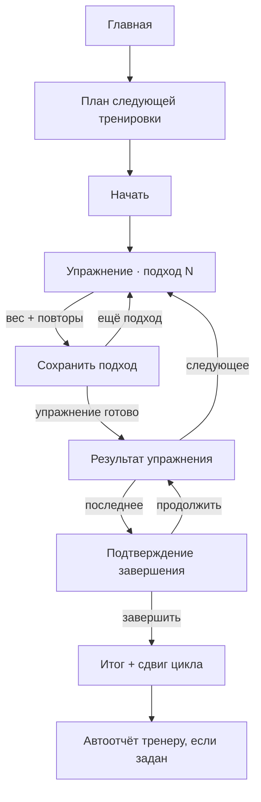
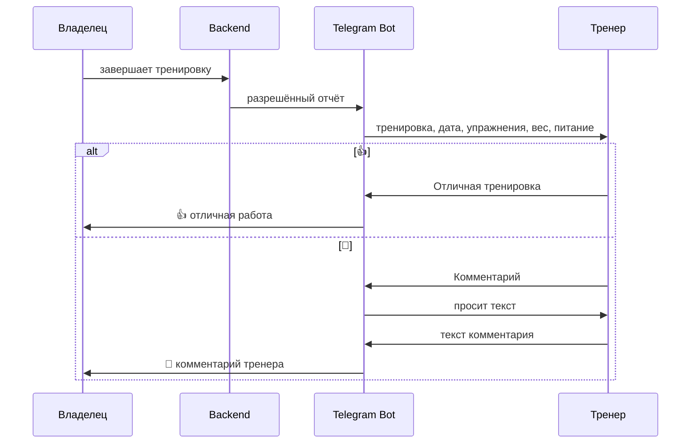

# User Flow FIT AI

## Владелец: первый запуск

1. Пользователь открывает бота.
2. Бот сверяет Telegram ID с `OWNER_TELEGRAM_ID`.
3. Кнопка «Открыть FIT AI» запускает Mini App.
4. Главная показывает следующую тренировку цикла и текущий прогресс.
5. Из «Быстрого ввода» доступны вес, питание и кардио в 1–2 касания.

Если ID не совпал, бот и API возвращают `⛔ Доступ запрещен`.

## Тренировка

Двойной тап не создаёт два подхода: UI блокируется, а API выполняет upsert. Повторное завершение не сдвигает цикл второй раз.

## Вес, питание и кардио

- Вес: открыть «Вес» → ввести кг → сохранить.
- Питание: «Питание» → калории + белок → сохранить; повтор в тот же день обновляет запись.
- Кардио: «Кардио» → дистанция + минуты → сохранить; backend рассчитывает sec/km, km/h и лучший результат.
- Валидация показывается рядом с формой; на сетевой ошибке данные остаются в форме.

## Прогресс и AI Coach

1. Пользователь открывает «Прогресс».
2. Видит вес, жим, подтягивания, кардио, графики и последние тренировки.
3. Нажимает «Запустить AI-анализ».
4. Backend собирает только allowlist числовых данных последних 7 дней.
5. UI показывает три коротких пункта на русском.

Если данных нет, отображается пустое состояние с ближайшим действием. Без API key возвращается полезная локальная заглушка.

## Цели

Вкладка показывает вес, подтягивания, жим и 5 км с progress bars. Фото формы остаётся приватным для владельца; тренер и AI его не получают.

## Тренер

У тренера нет Mini App owner-flow, AI, целей или фото. При пустом `TRAINER_TELEGRAM_ID` отчёт не отправляется и завершение тренировки остаётся успешным.

## Напоминания

Напоминания опираются на фактические события, а не тренировочные дни недели. Пользователь может отдыхать и пропускать дни; следующий шаблон не меняется до завершения тренировки.
